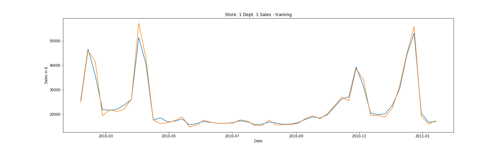

# Retail Store Sales Forecast
This project is a solution for Retail Store Sales Forecasting which is implemented on Python and Jupyter Notebook.

In the repository, you can find 
- the [Python3 code](retail_store_sales_forecast.ipynb) 
- a detailed [report](REPORT.md) of the project 
- the [data](data/) which is used for the project.

### Requirements:

Scikit-learn, pandas, numpy, os, matplotlib, seaborn and ipython libraries are imported for the project.

The libraries can be downloaded by the following line.

    pip install -r requirements.txt

### Model
For this project I implemented an ensemble learning method: Random Forest Regression with 100 estimators (100 trees). Random Forest is modelled by fitting the data into n different estimators (trees). It simply performes as described in the following: The estimators vote for an answer. Highest voted answer is chosen as an answer.

### Predictions
#### Prediction of training data
In the figure below, the prediction of training data and groundtruth is plotted (only for the 1st store's 1st department). Training Mean Squared Error (MSE) is noted as 1632 and r squared value is 0.99.

Training data: the data which I used for fitting the Random Forest model.

#### Prediction of validation data
In the following graph, the prediction of validation data and groundtruth is plotted (only for the 1st store's 1st department). Validation Mean Squared Error (MSE) is noted as 5851 and r squared value is 0.93.

Validation data: the data which the model has not seen before, splitted before fitting.

#### Prediction of test data
Lastly, the future sales of the 1st store's 1st department, which is forecasted by the Random Forest model, is plotted. 

### Comparison of Errors
Second part of the project requires proving the importance of holiday markdowns where the model is trained without date information.

Holiday markdowns: Four columns where each column is a flag of a holiday: (Labor Day, Christmas, Easter, Thanksgiving).

In below, the comparison of two different model is shown. 
        
    model_with row is the Random Forest model where it is fitted with holiday markdowns (columns). 
    model_without row is the same Random Forest model in below, the only difference is it is fitted without holiday markdowns (columns).
    training column is the MSE error of prediction of training data.
    validation column is the MSE error of performance of the models on validation data.
        

