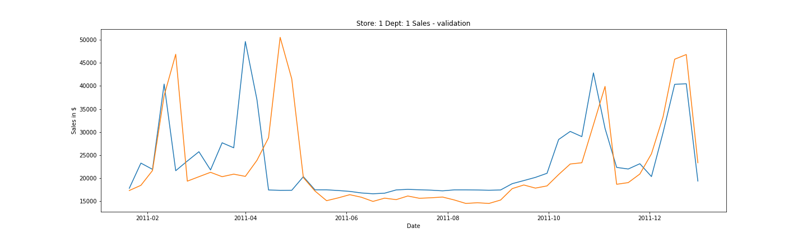

# Retail Store Sales Forecast

### Data
Data includes following columns:

    - Date        : Weekly separated dates.
    - Store       : Number of store.
    - Department  : Number of department for the store.
    - Temperature : Temparature (F) at given date.
    - IsHoliday   : Holiday flag of the date.
    - Fuel Price  : Fuel price at given date.
    - CPI         : Consumer Price Index at current date.
    - Unemployment: Unemployment at given date
    - Type        : Type of the store (A, B or C)
    - Size        : Size of the store
    - Weekly Sales: Sales ($) at given date.

### Objectives
1- Forecasting future sales of Retail Stores for each store-department.

2- Proving the importance of four biggest holiday markdowns on results.

### Dataset
Dataset consists of historical sales data for 45 stores located in different regions. Each store contains a number of departments. Dataset contains train.csv, test.csv, features.csv, stores.csv files. 

    1- *stores.csv*   : This file contains anonymized information about the 45 stores, indicating the type and size of store.

    2- *features.csv* : This file contains additional data related to the store, department, and regional activity for the given dates. 

    3- *train.csv*    : This is the historical training data, which covers to 2010-02-05 to 2012-01-01.

    4- *test.csv*     : This file is identical to train.csv, except we have withheld the weekly sales. You must predict the sales for each triplet of store, department, and date in this file.

### Data Handling
Dataset is prepared by
- merging features & stores dataframes with train and test dataframes. 
- encoding string types of 'Date' and 'Type' features and changing 'IsHoliday' feature from boolean type into integer type.
- adding time information by extracting week of the year value from 'Date' column.
- analysing if there is any NaN value in training and test dataframes.
- extracting 4 biggest holiday information and adding them into training and test dataframe.
- visualizing correlation matrix for feature anaylsis
- splitting training material (which we have groundtruth value) into two parts for inspecting over/under fitting. (training data, validation data)

Processed dataframe which is used for training is shown in the following.

Correlation matrix of features are visualized in order to get an intuition about the dataset.

### Model Proposing
For this objective, an ensemble learning method, Random Forest Regressor is proposed with 100 trees for estimation.

Model is fitted with training data with sample weight where if holiday the sample weight is 5 else 1. It is noted that weighting is not neccessary for RF method.

### Performance Evaluation
Mean Squared Error is evaluated for this training. And the results of training-to-training and validation-to-training performances are plotted.

In below, the performance of model over the dataset which has 16k mean and 23k standard deviation and over 294k sales.

Metrics | training  | validation   | 
|:---:|:-------------:| -----:|
|MSE| 1623 | 5851 | 
| r-squared value| 0.99 | 0.93 |

### Task 2: Comparison of Importance of Markdowns where there is no time information
2 identical models are fitted with two training data whose difference is only markdown columns absence or presence.

As a result, while it is not a big difference in training error, it has a 40% improvement when holiday information columns are used.
 

### Finalizing the Model
Finally, the model is trained with the whole training material (recall we used half of it for training and the other half for evaluation).

Test data is prepared for forecasting future sales.

### Future Sales Forecasting
In below, future sales of the store 1 and department 1 is plotted. The graph shows future predictions of aforementioned department's sales over date.

