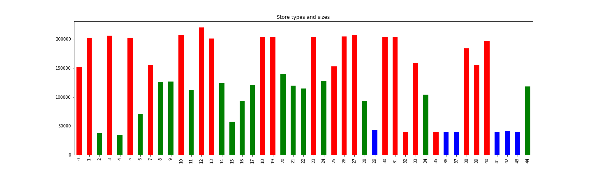

### Data Analysis
In this file, 

#### Stores Analysis
In the stores.csv file, there are several information columns for each store in Retail Stores. stores.csv dataframe can be shown as below.

Every store has its type (A-B-C) and its size. In the following pie-chart, number of different types of stores are visualized.

As it can be seen, there are 22 A-type stores, 17 B-type stores and 6 C-type stores. In the figure, bar-chart of the stores are visualized.

