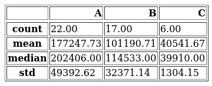
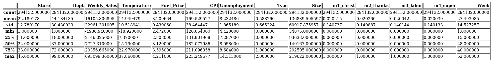
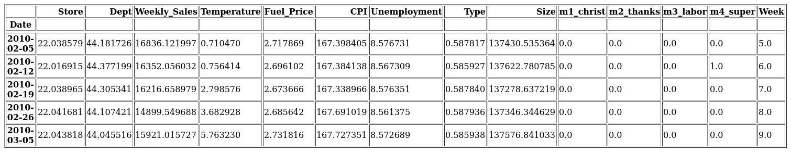
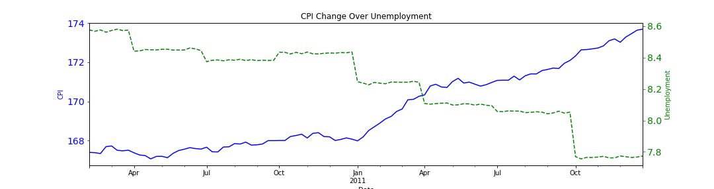
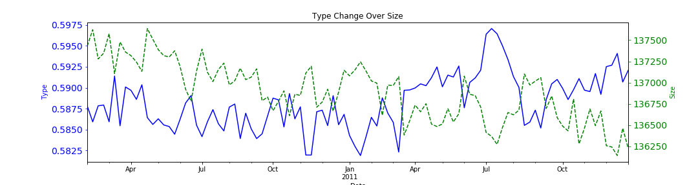
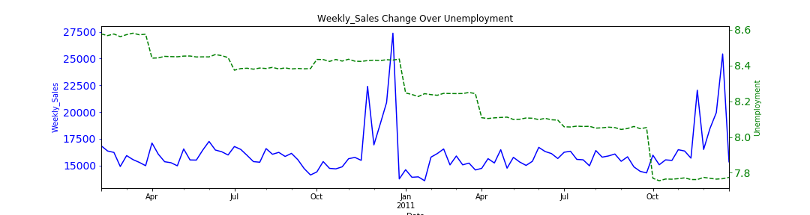
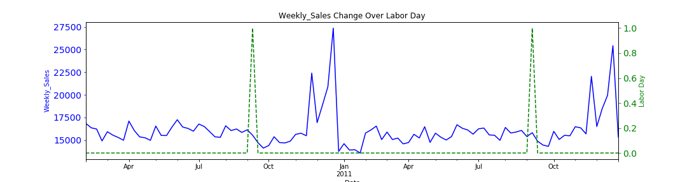

### Data Analysis
In this file, 

#### Stores Analysis
In the stores.csv file, there are several information columns for each store in Retail Stores. stores.csv dataframe can be shown as below.

Every store has its type (A-B-C) and its size. In the following pie-chart, number of different types of stores are visualized.

As it can be seen, there are 22 A-type stores, 17 B-type stores and 6 C-type stores. In the next figure, distribution of sizes is visualized. It can be interpreted that stores can be classified by their size according to the size distribution of the stores. 

    if 0 <store.size < 75k:
        store = small
    elif 75k < store.size < 175k:
        store = medium
    elif 175k < store.size:
        store = big
    else:
        print('error value')
        return False
      
  After examining size distribution, the stats of stores and correlation of size with type will be discussed. In the following table, number of type stores, mean size, median size and standard deviation size of corresponding type. 
  
 
In the following bar-chart, y axis represents size of stores and x axis represents store id. Moreover, type of each store is marked with different colors (see pie-chart).
  
  
It can be concluded that while A type of stores are generally big sized stores, B type of stores are medium and C type of stores are small sized stores. 

### Training Dataframe Analysis
In the following tables, merged dataframe and its statistics will be visualized.

For better resolution, please click on the table and examine the table in following tab.

While there may be some information to extract, for better representation, correlation matrix will be visualized.

and its thresholded version. For feature selection, I've used 0.25 value for thresholding the correlation. In other words, if two features are correlated more than abs(0.25), then they are correlated.

The (negative) correlation can be seen in between CPI-Unemployment and (encoded)Type-Size. For better illustration, their average changes over date will be plotted. 

Average changes: the dataframe is groupby date and each group is averaged. In other words, below each feature, there is average value on given date. Main idea is to generalize the dataframe. New averaged dataframe looks like in below.

After explaining average dataframe, average dataframe's CPI changes and Unemployment changes over time is plotted, in the next two figures.

In the plots, it is more obvious that each two features are negatively proportional to each other. It means that, using both of the features does not make huge difference at results than using only one of them. On the other hand, using more features will require more time to process during fitting. Thus, only one of each plots can be used for fitting.

In the next figures, the Weekly Sales changes and each feature's changes over date will be plotted and examined. 

