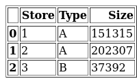
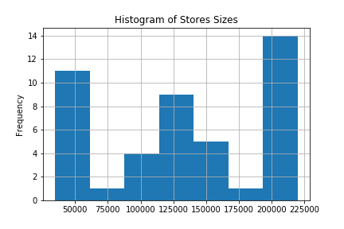

### Data Analysis
In this file, 

#### Stores Analysis
In the stores.csv file, there are several information columns for each store in Retail Stores. stores.csv dataframe can be shown as below.

Every store has its type (A-B-C) and its size. In the following pie-chart, number of different types of stores are visualized.

As it can be seen, there are 22 A-type stores, 17 B-type stores and 6 C-type stores. In the next figure, distribution of sizes is visualized. It can be interpreted that stores can be classified by their size according to the size distribution of the stores. 

    if 0 <store.size < 75k:
        store = small
    elif 75k < store.size < 175k:
        store = medium
    elif 175k < store.size:
        store = big
    else:
        print('error value')
        return False
      
  After examining size distribution, the stats of stores and correlation of size with type will be discussed. In the following table, number of type stores, mean size, median size and standard deviation size of corresponding type. 
  
 
In the following bar-chart, y axis represents size of stores and x axis represents store id. Moreover, type of each store is marked with different colors (see pie-chart).
  
  
It can be concluded that while A type of stores are generally big sized stores, B type of stores are medium and C type of stores are small sized stores. 
